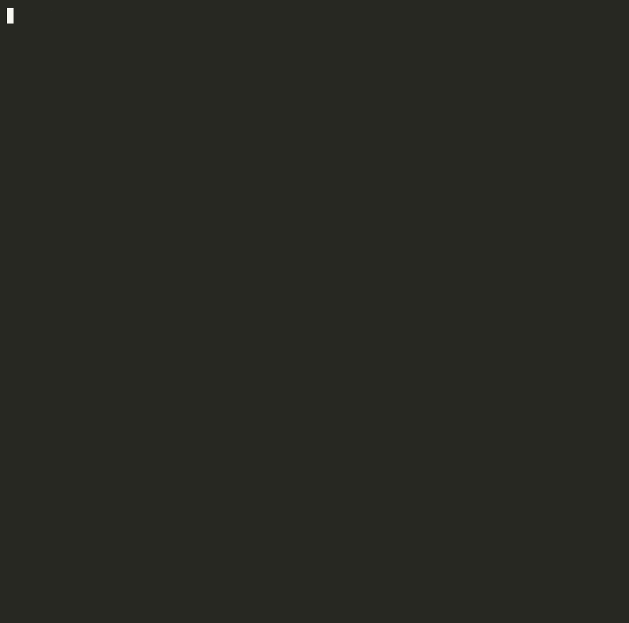

<div align="center">

# Make Me Unicorn

**Cubre también lo que no sabes que te falta. Lanza tu SaaS con confianza.**

La checklist de lanzamiento y sistema operativo de código abierto para creadores independientes.

[](./LICENSE)
[](https://pypi.org/project/make-me-unicorn/)
[](https://pypi.org/project/make-me-unicorn/)
[](./SPEC.md)
[](./.github/workflows/mmu-guardrails.yml)
[](./CONTRIBUTING.md)

[🇺🇸 English](./README.md) · [🇰🇷 한국어](./README.ko.md) · [🇯🇵 日本語](./README.ja.md) · [🇨🇳 简体中文](./README.zh-CN.md) · **🇪🇸 Español**




</div>

## El Problema

Estás construyendo un producto SaaS. Usas IA para programar más rápido que nunca. Pero entonces:

> "Momento... ¿agregué el flujo de recuperación de contraseña?"
>
> "El webhook de pagos... ¿es idempotente?"
>
> "¿Tengo política de privacidad? ¿Política de reembolsos? ¿etiquetas OG?"
>
> "¿Qué decidí la semana pasada sobre el proveedor de autenticación? ¿Por qué?"

**No estás fallando al programar. Estás fallando en dar seguimiento a lo que importa.**

Todo creador independiente se topa con los mismos muros:

| Qué sale mal | Qué te cuesta |
|--------------|---------------|
| Te olvidas del restablecimiento de contraseña mientras construyes el inicio de sesión | Los usuarios se quedan bloqueados el día 1 |
| Te saltas la verificación de firma del webhook | Los atacantes replican eventos de pago |
| Lanzas sin etiquetas OG | Cada enlace compartido se ve roto |
| Pierdes el contexto entre sesiones de IA | Re-explicas tu proyecto desde cero, cada vez |
| No tienes política de reembolsos | Primera disputa = cuenta de Stripe congelada |

MMU atrapa estos problemas **antes de que te cuesten usuarios, dinero o confianza**.

## Cómo Funciona

```
mmu init                    # 1. Obtén más de 670 elementos de checklist en 15 categorías
mmu scan                    # 2. Detecta tu stack automáticamente y marca lo que ya tienes
mmu                         # 3. Ve qué está hecho y qué falta
mmu status --why            # 4. Entiende tu puntuación — qué cuenta y qué se omite
mmu next                    # 5. Obtén las próximas acciones priorizadas
```

```text
  MAKE ME UNICORN - STATUS DASHBOARD

          .--*--.
         / *v*  \
        |       |
         \ ___ /
          '---'

  Stage: HATCHING    ######..............  22%  (124/551)

  LAUNCH GATES  (16/26)
    M0 Problem Fit         ################   4/4   PASS
    M1 Build Fit           ################   5/5   PASS
    M2 Revenue Fit         ############....   3/4   OPEN
    M3 Trust Fit           ################   4/4   PASS
    M4 Growth Fit          ########........   2/4   OPEN
    M5 Scale Fit           ####............   1/5   OPEN

  BLUEPRINTS  (124/551)
    Frontend           ##########......  18/35  51%
    Backend            ############....  24/46  52%
    Auth               ##########......  16/42  38%
    Billing            ########........  11/36  30%
    ...11 more
```

Tu unicornio evoluciona mientras construyes: Egg → Hatching → Foal → Young → Unicorn → Legendary.

## Personaliza Tu Checklist

No todo proyecto necesita facturación. No todo producto necesita i18n. MMU se adapta:

```bash
mmu init                      # selecciona tu stack (Next.js, Django, Rails, ...)
```

Al ejecutar `mmu init`, se genera `.mmu/config.toml`.  
Con estos flags puedes excluir del cálculo de puntuación los ítems que no aplican a tu proyecto.

```toml
[features]
billing = false               # Si no tienes facturación, se excluye la sección billing
email_transactional = true
email_marketing = false
i18n = false
file_upload = false
mfa = false
ab_testing = false
webhooks_outgoing = false

[architecture]
containerized = false
iac = false
ssr = true
serverless = false

[market]
targets_eu = false
targets_california = false
targets_korea = true
```

Tu puntuación refleja **solo lo que aplica a tu proyecto**.  
`mmu status --why` muestra de forma transparente qué se cuenta y qué se excluye.

## Qué Cubre MMU (Para Que No Tengas Que Recordarlo)

<table>
<tr>
<td width="33%">

**Construir el producto**
- Frontend (responsive, accesibilidad, formularios)
- Backend (API, DB, colas)
- Autenticación (inicio de sesión, restablecimiento, OAuth, sesiones)
- Facturación (Stripe, webhooks, reembolsos)
- Pruebas (unitarias, E2E, seguridad de agentes)

</td>
<td width="33%">

**Preparar el lanzamiento**
- SEO (etiquetas OG, mapa del sitio, metadatos)
- Legal (privacidad, términos, GDPR)
- Seguridad (CORS, límites de tasa, gestión de secretos)
- Rendimiento (caché, carga diferida)
- CI/CD (pipeline, plan de reversión)

</td>
<td width="34%">

**Operarlo después del lanzamiento**
- Monitoreo (errores, disponibilidad, alertas)
- Analítica (embudo, retención, eventos)
- Correo (transaccional, plantillas)
- Accesibilidad (WCAG, navegación por teclado)
- Confiabilidad (copias de seguridad, plan de incidentes)

</td>
</tr>
</table>

**670+ elementos. 15 categorías. Cero improvisación.**

## ¿En Qué Se Diferencia MMU?

| | Alcance | Dónde vive | Nativo para agentes | Seguimiento de progreso |
|---|---|---|---|---|
| **MMU** | SaaS completo: código + facturación + legal + growth + operaciones | Markdown en tu repo | ✅ Plugin de Claude + servidor MCP | ✅ Puntuación, gates, dashboard que evoluciona |
| Lighthouse | Solo rendimiento/a11y/SEO de frontend | Navegador/CI | ❌ | Puntuación por ejecución, sin memoria del proyecto |
| Checklists de vendors (docs de Vercel, Stripe) | Solo el área de ese vendor | Su sitio de docs | ❌ | ❌ Solo lectura |
| Repos de checklists estáticos / plantillas de Notion | A menudo no verificable | Copiar y pegar | ❌ | ❌ Manual, se queda obsoleto |
| Revisores de código con IA (CodeRabbit, etc.) | Diffs de código | Flujo de PR | Parcialmente | Solo por PR, sin visión de lanzamiento |

MMU no es un linter ni un sitio de documentación: es la **capa operativa entre tus sesiones de AI coding y un lanzamiento real**: tu CLI, tu CI y tus agentes de IA leen y actualizan la misma checklist.

## Vibe Check Para Tu Código Generado Por IA

El 45% del código generado por IA se publica con vulnerabilidades. Un comando escanea lo que los asistentes de IA más olvidan:

```bash
mmu vibecheck
```

Comprueba: secretos hardcodeados · `.env` sin gitignore · verificación de firma + idempotencia de webhooks · flujo de password reset · SQL con f-strings · rate limiting · CORS comodín · `DEBUG = True` · monitoreo de errores. Los hallazgos P0 salen con código distinto de cero, listo para CI.

## Para Quién Es

| Tú eres... | MMU te ayuda a... |
|-------------|-------------------|
| **Un fundador que programa con IA** | Dejar de re-explicar tu proyecto en cada sesión. Mantener el contexto entre herramientas. |
| **Un desarrollador frontend** | Saber exactamente qué construir: flujos de autenticación, estados de error, puntos de quiebre responsive y etiquetas OG. |
| **Un product manager / planificador** | Obtener un PRD estructurado, estrategia de precios y checklist de lanzamiento, todo en Markdown. |
| **Un desarrollador fullstack** | Rastrear frontend, backend, facturación y cumplimiento en un solo lugar. Que no se escape nada. |

## Pruébalo en 60 Segundos

```bash
pip install make-me-unicorn
cd your-project
mmu init && mmu scan && mmu status --why
```

Eso es todo. Verás tu puntuación de preparación para el lanzamiento, lo que está hecho, lo que falta y por qué.

Luego ejecuta `mmu next` para saber qué hacer primero.

## Inicio Rápido

```bash
pip install -e .

# Opción A: Empieza con plantillas vacías y complétalas tú
mmu init

# Opción B: Deja que Claude genere la documentación del proyecto (requiere API key)
pip install -e ".[llm]"
export ANTHROPIC_API_KEY=sk-ant-...
mmu init --interactive        # responde 5 preguntas y obtiene docs de estrategia, producto y precios
```

Luego:

```bash
mmu scan                      # detecta automáticamente tu stack técnico
mmu                           # mira tu panel
mmu status --why              # mira cómo se calcula tu puntuación
mmu next                      # obtén tus 3 próximas acciones priorizadas
mmu show frontend             # entra en detalle de cualquier categoría
mmu check frontend 3          # marca elementos como completados
mmu gate --stage M0           # verifica si estás listo para la siguiente fase
mmu doctor                    # ejecuta chequeos de salud de guardrails
```

## Comparte Tu Puntuación

Muestra tu nivel de preparación para el lanzamiento. Pégalo en tu README, tuiteálo o compártelo en Discord.

```bash
mmu share                     # imprime la tarjeta de puntuación compartible
mmu share --clipboard         # copia al portapapeles (macOS)
```

```
┌─────────────────────────────────────────────┐
│  Make Me Unicorn — Launch Readiness         │
│                                             │
│  Score: 68%  Stage: YOUNG UNICORN           │
│                                             │
│  M0 Problem Fit    ████████████████  PASS   │
│  M1 Build Fit      ████████████████  PASS   │
│  M2 Revenue Fit    ██████████░░░░░░  OPEN   │
│  M3 Trust Fit      ████████████████  PASS   │
│  M4 Growth Fit     ████████░░░░░░░░  OPEN   │
│  M5 Scale Fit      ████░░░░░░░░░░░░  OPEN   │
│                                             │
│  Stack: Next.js · Stripe · SSR              │
│  pip install make-me-unicorn                │
│  #MakeMeUnicorn                             │
└─────────────────────────────────────────────┘
```

## 6 Puertas de Lanzamiento

Piensa en estas como salidas de fase. No te las saltes.

```
M0 Problem Fit    →  ¿Sabes para QUIÉN construyes y POR QUÉ?
M1 Build Fit      →  ¿El producto principal funciona de punta a punta?
M2 Revenue Fit    →  ¿Alguien puede pagarte? ¿Y recibir un reembolso?
M3 Trust Fit      →  ¿Política de privacidad? ¿Canal de soporte? ¿Logs?
M4 Growth Fit     →  ¿Los enlaces compartidos se ven bien? ¿Pueden encontrarte?
M5 Scale Fit      →  ¿Qué pasa cuando algo falla a las 3 a. m.?
```

Ejecuta `mmu gate --stage M0` para verificar. Todos los elementos sin marcar = NOT PASS.

## 12 Modos de Operación

Un modo por sesión. Cada modo carga solo los documentos que necesitas.

```bash
mmu start --mode backend      # carga: architecture.md, sprint, registros ADR
mmu start --mode billing      # carga: pricing.md, checklist de facturación, cumplimiento
mmu start --mode growth       # carga: checklist SEO, métricas
```

Esto previene el problema #1 de programar con IA: **sobrecarga de contexto**. Tu asistente de IA recibe solo lo que necesita — no tu proyecto entero.

## Integración con IA (Opcional)

MMU funciona sin ninguna IA. Pero con Claude, se vuelve poderoso:

```bash
pip install make-me-unicorn[llm]
export ANTHROPIC_API_KEY=sk-ant-...
```

| Comando | Qué hace |
|---------|----------|
| `mmu init --interactive` | Responde 5 preguntas sobre tu producto. Claude escribe tu estrategia, especificación de producto, precios, arquitectura y documentos de UX. |
| `mmu start --mode X --agent` | Auto-formatea el contexto de tu sesión — pega directamente en Claude Code o cualquier LLM. |
| `mmu doctor --deep` | Claude lee tu código y docs, detecta inconsistencias, brechas de seguridad y puntos ciegos. |
| `mmu generate strategy` | Genera o actualiza cualquier documento clave según el estado actual de tu proyecto. |

El CLI core no tiene dependencias externas. Las funciones de IA son opcionales y se degradan de forma segura.

## Usar como Skill de Claude

MMU también está empaquetado como plugin de Claude Code + Anthropic Agent Skill. En cualquier herramienta compatible con la especificación Agent Skills (Claude Code, Claude Desktop, OpenAI Codex CLI), MMU se invoca automáticamente cuando mencionás frases como "validar mi idea de SaaS" o "checklist de lanzamiento".

```bash
# Dentro de Claude Code:
/plugin marketplace add minjikim89/make-me-unicorn
/plugin install make-me-unicorn
```

El skill carga solamente los blueprints relevantes para la conversación (progressive disclosure), manteniendo bajo el costo de contexto.

## Modo Servidor MCP

MMU también funciona como servidor MCP (Model Context Protocol). Cualquier agente compatible con MCP (Claude Code, Claude Desktop, Cursor, Gemini CLI) puede llamar los blueprints y templates de MMU como herramientas nativas.

```bash
pip install make-me-unicorn[mcp]
mmu serve-mcp                          # transporte stdio (por defecto)
mmu serve-mcp --transport sse          # transporte SSE
```

Configuración de Claude Desktop (`~/Library/Application Support/Claude/claude_desktop_config.json`):

```json
{
  "mcpServers": {
    "mmu": {
      "command": "mmu",
      "args": ["serve-mcp", "--root", "/path/to/cloned/make-me-unicorn"]
    }
  }
}
```

Herramientas expuestas:

- `mmu_list_blueprints` — lista 17 blueprints (15 core + 2 de industria)
- `mmu_get_blueprint(name)` — obtiene el markdown completo de un blueprint
- `mmu_list_idea_templates` — lista los prompts start/close/ADR + el kit de Product Hunt
- `mmu_validate_idea(idea)` — valida contra hilos reales de HN + Reddit: veredicto, sentimiento, competidores, hilos principales (modo gratuito, sin claves API; requiere el extra `[validate]`)

## Validar una Idea

Tomá señal real de HN + Reddit antes de construir:

```bash
pip install make-me-unicorn[validate]
mmu validate "tutor de IA para niños" --limit 30
```

El modo por defecto es **gratis** — sin API key, sin llamadas de pago. Búsqueda pública en Reddit + HN Algolia, análisis de sentimiento VADER local, extracción de competidores por tokens en mayúscula. Guarda un reporte markdown en `reports/validate/<slug>.md`.

Para un veredicto de validación de una página sintetizado a partir de los hilos:

```bash
mmu validate "tutor de IA para niños" --llm
# Pide confirmación de costo (~$0.05–0.20). Usá -y para saltarlo.
```

`--llm` es opt-in explícito — el flujo por defecto nunca llama a la API de Anthropic.

## Flujo de Sesión

Cada sesión sigue el mismo ritmo:

```
1. mmu start --mode backend      ← elige un foco y carga los docs relevantes
2. Build / decide / validate      ← haz el trabajo
3. mmu close                      ← registra qué cambió y qué sigue
```

El cierre de sesión usa etiquetas estructuradas para la memoria:

- `[DONE]` — lo que completaste
- `[DECISION]` — decisiones tomadas (crear ADR si es significativo)
- `[ISSUE]` — qué salió mal (categorizar: brecha de contexto / dirección incorrecta / conflicto doc-código)
- `[NEXT]` — primera tarea para la próxima sesión

Esto significa que tu próxima sesión arranca en **5 segundos**, no en 15 minutos de "¿dónde me quedé?"

## Ejemplo: TaskNote

Mira un ejemplo completo de MMU en acción:

```
examples/filled/tasknote/
├── docs/core/strategy.md      ← ICP, propuesta de valor, competidores
├── docs/core/product.md       ← alcance del MVP, recorrido de usuario, P0/P1
├── docs/core/pricing.md       ← Free/Pro/Team, reglas de facturación
├── docs/core/architecture.md  ← Next.js + FastAPI + Postgres
├── docs/adr/001_billing_provider_choice.md  ← ¿Por qué Stripe?
└── current_sprint.md          ← 3 objetivos de esta semana
```

## Requisitos

- Python `3.10+`
- `pip`
- CLI core: cero dependencias externas
- Funciones de IA: `pip install make-me-unicorn[llm]`

## Estructura del Proyecto

```
make-me-unicorn/
├── src/mmu_cli/           # CLI source (Python)
├── docs/
│   ├── core/              # Strategy, Product, Pricing, Architecture, UX
│   ├── ops/               # Roadmap, Metrics, Compliance, Reliability
│   ├── blueprints/        # 15 category checklists (670+ items)
│   ├── checklists/        # M0–M5 launch gates
│   └── adr/               # Decision log templates
├── prompts/               # Session start/close/ADR templates
├── examples/filled/       # Concrete example (TaskNote)
└── tests/                 # Unit tests
```

## Controles de CI

`mmu doctor` se ejecuta en cada PR. `mmu gate` se ejecuta para las etapas listadas en `docs/ops/gate_targets.txt`.

## Contribuir

Ver `CONTRIBUTING.md`.

## Licencia

MIT. Ver `LICENSE`.
