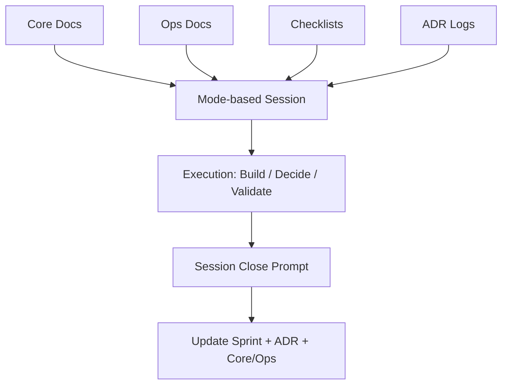

<div align="center">

# Make Me Unicorn

**FounderMode for solo SaaS builders**

SaaS from scratch, without execution drift.

[](./LICENSE)
[](./ROADMAP.md)
[](./docs)
[](./SPEC.md)
[](./.github/workflows/mmu-guardrails.yml)
[](./CONTRIBUTING.md)


</div>

## 🚀 Start Here

### TL;DR

- `Make Me Unicorn` is a read-first founder operating system.
- Use `snapshot` for fast diagnostics, then decide what to fix.
- Use `mmu` for structured execution (`start`, `doctor`, `gate`, `close`).

### Quick Links

- 📘 `Unicorn.md` - daily operating hub
- 🗂 `current_sprint.md` - this week execution focus
- ✅ `docs/checklists/from_scratch.md` - stage gate checklist
- 🧭 `docs/ops/mode_playbook.md` - mode rules

### 30-Second Diagnostic (Read-Only)

```bash
./snapshot <target-project-path> --no-md
```

Example:

```bash
./snapshot ../vista-sphere-pro --no-md
```

### Repo Map

- `docs/core/*` - durable strategy/product/architecture context
- `docs/ops/*` - operations, roadmap, reliability, compliance
- `docs/checklists/*` - practical launch/risk checklists
- `prompts/*` - start/close/ADR session templates
- `src/mmu_cli/*` - installable `mmu` CLI implementation
- `scripts/*` - helper scripts (`mmu.sh`, guardrails, snapshot logic)
- `examples/*` - filled example(s)
- `reports/*` - local snapshot reports (generated)

## 🦄 What Is This

`Make Me Unicorn` is an open-source operating system for solo founders building SaaS from scratch.

It gives you a practical structure to run strategy, product, design, frontend, backend, auth, billing, compliance, growth, and launch without losing context when switching between LLMs.

## ⚠️ Why This Exists

Most founders do not fail because of missing code snippets.
They fail because of execution drift.

- Context resets every time you switch model/tool.
- Decisions are made but the rationale is not preserved.
- Critical blind spots are missed: auth recovery, webhook idempotency, legal pages, OG preview metadata, staging separation.

`Make Me Unicorn` solves this with:

1. Structured docs as source of truth
2. Mode-based context injection
3. Decision logs (ADR) as memory
4. Phase gates for SaaS from scratch
5. Session start/close prompts for repeatable operation

## 🏗 Architecture



## 🛂 SaaS From Scratch Gates

Use these gates as non-negotiable checkpoints.

| Gate | Objective | Exit Criteria |
|---|---|---|
| `M0 Problem Fit` | Validate customer and problem | ICP, problem statement, success metric defined |
| `M1 Build Fit` | Deliver core product value | End-to-end core flow works with error states |
| `M2 Revenue Fit` | Add pricing and payment | Paid plan, success/failure/refund paths verified |
| `M3 Trust Fit` | Establish trust baseline | Privacy/terms/support path/logging in place |
| `M4 Growth Fit` | Enable discoverability | Metadata, OG image, sitemap, analytics live |
| `M5 Scale Fit` | Prepare resilient operation | Backup/recovery/incident playbook enforced |

See `docs/checklists/from_scratch.md` for the full checklist.

## 🎛 Mode System

One mode per session keeps decisions coherent.

| Mode | Purpose | Primary Inputs |
|---|---|---|
| `problem` | ICP, pain, hypothesis | `docs/core/strategy.md`, `docs/research/*` |
| `product` | Scope and prioritization | `docs/core/product.md`, `docs/ops/roadmap.md` |
| `design` | UX/UI and content | `docs/core/ux.md`, `docs/core/product.md` |
| `frontend` | Client implementation | `docs/core/architecture.md`, `current_sprint.md` |
| `backend` | API/data/jobs | `docs/core/architecture.md`, `current_sprint.md`, `docs/adr/*` |
| `auth` | Identity and access | `docs/checklists/auth_security.md`, `docs/core/architecture.md` |
| `billing` | Plans/payment/refunds | `docs/core/pricing.md`, `docs/checklists/billing_tax.md`, `docs/ops/compliance.md` |
| `growth` | SEO/distribution | `docs/checklists/seo_distribution.md`, `docs/ops/metrics.md` |
| `compliance` | Policy/data/legal baseline | `docs/ops/compliance.md`, `docs/core/pricing.md` |
| `reliability` | Monitoring/backup/incident | `docs/ops/reliability.md`, `docs/checklists/release_readiness.md` |
| `analytics` | Event model/experiments | `docs/ops/metrics.md`, `docs/core/product.md` |
| `launch` | Release readiness | `docs/checklists/release_readiness.md`, `docs/ops/roadmap.md` |

Full rules: `docs/ops/mode_playbook.md`

## 📦 What You Get

- `Unicorn.md` as the operating hub
- `assets/brand/*` for README and social-preview visuals
- `docs/core/*` for durable product strategy context
- `docs/ops/*` for operational control
- `docs/checklists/*` for blind-spot prevention
- `docs/adr/*` for decision memory
- `prompts/*` for repeatable session start/close workflows
- `current_sprint.md` for active execution
- `scripts/mmu.sh` as runtime helper CLI (prototype)
- installable `mmu` CLI (`pip install -e .`)
- `SPEC.md` for CLI behavior contract
- `docs/ops/evolution_path.md` for MVP -> Phase roadmap
- `CODE_OF_CONDUCT.md` and issue/PR templates for community operations

## 🧪 Runtime CLI (Prototype)

```bash
cd make-me-unicorn
pip install -e .
mmu start --mode product
mmu doctor
mmu gate --stage M2
mmu close
```

Wrapper usage also works:

```bash
./scripts/mmu.sh start --mode product
```

No-install fallback:

```bash
PYTHONPATH=src python3 -m mmu_cli doctor
```

Spec details: `SPEC.md`, CI enforcement: `.github/workflows/mmu-guardrails.yml`

## 🔧 Requirements

- Python `3.10+` (recommended `3.11`)
- `pip`

## ⚡ Quick Start

1. Fill baseline docs in `docs/core/*`.
2. Set weekly top goals in `current_sprint.md`.
3. Start each session with `prompts/start.md`.
4. Capture major decisions with `prompts/adr.md`.
5. End every session with `prompts/close.md`.

## 🛡 Common Misses This Project Prevents

- Missing account recovery while implementing login
- Running payment without refund/cancellation policy
- No webhook signature verification and idempotency
- No `dev/staging/prod` separation before release
- Missing OG thumbnail and social link preview validation
- Policy pages exist but no data deletion workflow

## 🕸 Optional Graph Layer

Start without ontology/graph complexity.

When needed, add a graph module as derived state from `docs/*`.
Keep markdown as the canonical source.

## 📈 Evolution Path

For staged maturation from MVP to later phases, see `docs/ops/evolution_path.md`.

Execution planning and status snapshots:

- `docs/ops/prd_8week_growth.md`
- `docs/ops/status_snapshot_2026-02-23.md`

## 🧩 Filled Example

See a concrete, filled-out SaaS operation example:

- `examples/filled/tasknote/README.md`

## ✅ CI Guardrails

`doctor` runs on every PR/push.
`gate` runs only for stages listed in `docs/ops/gate_targets.txt`.
No stages are enforced by default. Add lines such as `M0` and `M1` to enable strict gate blocking.
Branch protection baseline: `docs/ops/repo_protection.md`.

## 🎨 Brand Setup

1. Replace the hero image at `assets/brand/unicorn-hero.png` (or update the README image path).
2. Place your social preview image at `assets/brand/og-cover.png`.
3. In GitHub repo settings, set Social preview to `assets/brand/og-cover.png`.
4. Verify link previews on Slack/X/Kakao/Messenger.

## 🗺 Roadmap

See `ROADMAP.md`.

## 🤝 Contributing

See `CONTRIBUTING.md`.

## 🔐 Security

See `SECURITY.md`.

## 📝 Changelog

See `CHANGELOG.md`.

## ⚖️ License

MIT. See `LICENSE`.
