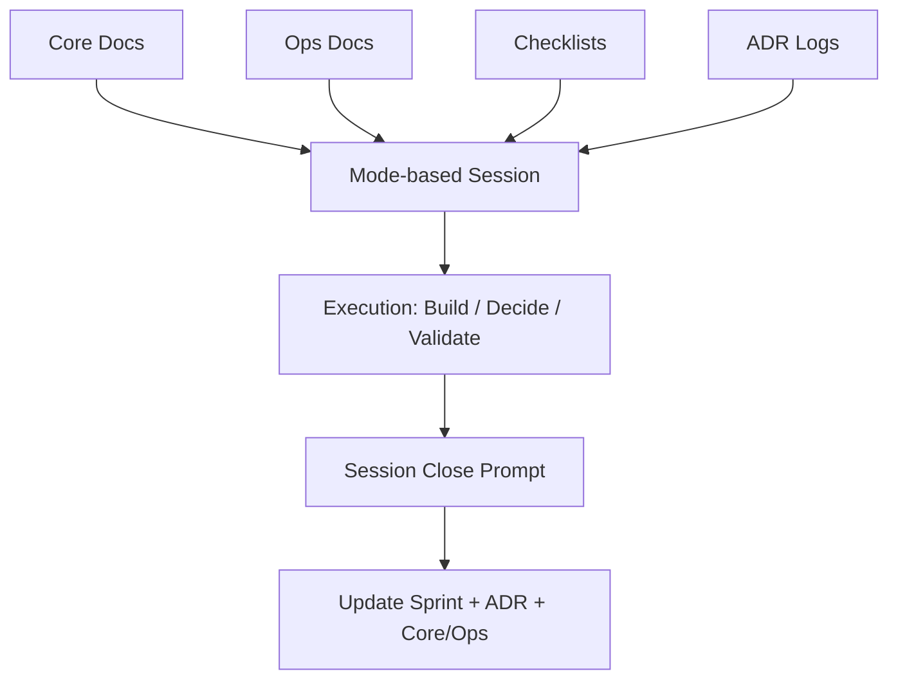

<div align="center">

# Make Me Unicorn

**FounderMode for solo SaaS builders**

SaaS from scratch, without execution drift.

[](./LICENSE)
[](./ROADMAP.md)
[](./docs)
[](./SPEC.md)
[](./.github/workflows/mmu-guardrails.yml)
[](./CONTRIBUTING.md)


</div>

## 🚀 Start Here

### TL;DR

```bash
pip install -e .
mmu init                    # scaffold docs + 15 blueprints (534 items)
mmu scan                    # auto-detect your tech stack and pre-check items
mmu                         # see your unicorn evolution dashboard
mmu show frontend           # drill into any blueprint
mmu check frontend 13       # check off completed items
```

### 🎬 Dashboard Preview

```text
  🦄  MAKE ME UNICORN — STATUS DASHBOARD

          .--*--.
         / °v°  \          Stage: HATCHING    ██████░░░░░░░░░░░░░░  22%
        |       |
         \ ___ /           📋 LAUNCH GATES  (21/26)
          '---'              M0 Problem Fit   ████████████████  ✓ PASS
                             M1 Build Fit     ████████████████  ✓ PASS
  🗺️ BLUEPRINTS (124/551)   M2 Revenue Fit   ████████████████  ✓ PASS
    Frontend    ██████░░  41%   M3 Trust Fit     ████████████████  ✓ PASS
    Backend     ████████░ 53%   M4 Growth Fit    ████████████░░░░  ✗ OPEN
    Auth        ██████░░  38%   M5 Scale Fit     ███░░░░░░░░░░░░░  ✗ OPEN
    ...13 more categories
```

Your unicorn evolves as you complete items: Egg → Hatching → Foal → Young → Unicorn → Legendary.

### Quick Links

- `docs/checklists/from_scratch.md` — stage gate checklist (M0–M5)
- `docs/blueprints/*.md` — 15 category blueprints (534+ items)
- `SPEC.md` — CLI behavior contract

## 🦄 What Is This

`Make Me Unicorn` is an open-source operating system for solo founders building SaaS from scratch.

It gives you a practical structure to run strategy, product, design, frontend, backend, auth, billing, compliance, growth, and launch without losing context when switching between LLMs.

## ⚠️ Why This Exists

Most founders do not fail because of missing code snippets.
They fail because of execution drift.

- Context resets every time you switch model/tool.
- Decisions are made but the rationale is not preserved.
- Critical blind spots are missed: auth recovery, webhook idempotency, legal pages, OG preview metadata, staging separation.

`Make Me Unicorn` solves this with:

1. Structured docs as source of truth
2. Mode-based context injection
3. Decision logs (ADR) as memory
4. Phase gates for SaaS from scratch
5. Session start/close prompts for repeatable operation

## 🏗 Architecture



## 🛂 SaaS From Scratch Gates

Use these gates as non-negotiable checkpoints.

| Gate | Objective | Exit Criteria |
|---|---|---|
| `M0 Problem Fit` | Validate customer and problem | ICP, problem statement, success metric defined |
| `M1 Build Fit` | Deliver core product value | End-to-end core flow works with error states |
| `M2 Revenue Fit` | Add pricing and payment | Paid plan, success/failure/refund paths verified |
| `M3 Trust Fit` | Establish trust baseline | Privacy/terms/support path/logging in place |
| `M4 Growth Fit` | Enable discoverability | Metadata, OG image, sitemap, analytics live |
| `M5 Scale Fit` | Prepare resilient operation | Backup/recovery/incident playbook enforced |

See `docs/checklists/from_scratch.md` for the full checklist.

## 🎛 Mode System

One mode per session keeps decisions coherent.

| Mode | Purpose | Primary Inputs |
|---|---|---|
| `problem` | ICP, pain, hypothesis | `docs/core/strategy.md`, `docs/research/*` |
| `product` | Scope and prioritization | `docs/core/product.md`, `docs/ops/roadmap.md` |
| `design` | UX/UI and content | `docs/core/ux.md`, `docs/core/product.md` |
| `frontend` | Client implementation | `docs/core/architecture.md`, `current_sprint.md` |
| `backend` | API/data/jobs | `docs/core/architecture.md`, `current_sprint.md`, `docs/adr/*` |
| `auth` | Identity and access | `docs/checklists/auth_security.md`, `docs/core/architecture.md` |
| `billing` | Plans/payment/refunds | `docs/core/pricing.md`, `docs/checklists/billing_tax.md`, `docs/ops/compliance.md` |
| `growth` | SEO/distribution | `docs/checklists/seo_distribution.md`, `docs/ops/metrics.md` |
| `compliance` | Policy/data/legal baseline | `docs/ops/compliance.md`, `docs/core/pricing.md` |
| `reliability` | Monitoring/backup/incident | `docs/ops/reliability.md`, `docs/checklists/release_readiness.md` |
| `analytics` | Event model/experiments | `docs/ops/metrics.md`, `docs/core/product.md` |
| `launch` | Release readiness | `docs/checklists/release_readiness.md`, `docs/ops/roadmap.md` |

Full rules: `docs/ops/mode_playbook.md`

## 📦 What You Get

- **Visual dashboard** — unicorn that evolves from egg to legendary as you build
- **15 blueprints** (534+ items) — Frontend, Backend, Auth, Billing, DevOps, Security, Monitoring, SEO, Legal, Performance, Testing, CI/CD, Email, Analytics, Accessibility
- **Auto-scan** — detect your tech stack and pre-check matching blueprint items
- **6 stage gates** (M0–M5) — Problem Fit → Scale Fit checkpoints
- **CLI item management** — `show`, `check`, `uncheck` for terminal-native workflow
- `docs/core/*` for durable product strategy context
- `docs/ops/*` for operational control
- `prompts/*` for repeatable session start/close workflows
- installable `mmu` CLI (`pip install -e .`)

## 🧪 CLI Commands

| Command | What it does |
|---------|-------------|
| `mmu` | Visual dashboard — unicorn evolution + gates + blueprints |
| `mmu scan` | Auto-detect tech stack and pre-check blueprint items |
| `mmu show <blueprint>` | Detailed blueprint view with numbered items |
| `mmu check <blueprint> <#>` | Mark an item as done |
| `mmu uncheck <blueprint> <#>` | Mark an item as not done |
| `mmu init` | Scaffold docs, checklists, and 15 blueprints |
| `mmu gate --stage M0` | Check if a gate stage is ready to pass |
| `mmu doctor` | Run guardrail health checks |
| `mmu start --mode product` | Start a focused working session |
| `mmu close` | Close current session |

Blueprint aliases: `frontend`, `front`, `back`, `auth`, `billing`, `seo`, `perf`, `a11y`, `ci`, etc.

### Install

```bash
cd make-me-unicorn
pip install -e .
```

### Typical Workflow

```bash
mmu init --root ~/my-saas       # 1. scaffold
mmu scan --root ~/my-saas       # 2. auto-detect existing work
mmu --root ~/my-saas            # 3. see dashboard
mmu show auth --root ~/my-saas  # 4. drill into category
mmu check auth 5 --root ~/my-saas  # 5. check off items
```

Spec details: `SPEC.md` · CI enforcement: `.github/workflows/mmu-guardrails.yml`

## 🔧 Requirements

- Python `3.10+` (recommended `3.12`)
- `pip`
- No external dependencies — pure Python stdlib

## ⚡ Quick Start

1. `mmu init` — scaffold baseline docs and blueprints.
2. `mmu scan` — auto-detect your tech stack and pre-check items.
3. `mmu` — see your unicorn dashboard.
4. `mmu show <blueprint>` — find what's missing.
5. Build, then `mmu check <blueprint> <#>` as you go.
6. `mmu gate --stage M0` — verify each gate before moving on.

## 🛡 Common Misses This Project Prevents

- Missing account recovery while implementing login
- Running payment without refund/cancellation policy
- No webhook signature verification and idempotency
- No `dev/staging/prod` separation before release
- Missing OG thumbnail and social link preview validation
- Policy pages exist but no data deletion workflow

## 🕸 Optional Graph Layer

Start without ontology/graph complexity.

When needed, add a graph module as derived state from `docs/*`.
Keep markdown as the canonical source.

## 📈 Evolution Path

For staged maturation from MVP to later phases, see `docs/ops/evolution_path.md`.

Execution planning and status snapshots:

- `docs/ops/prd_8week_growth.md`
- `docs/ops/status_snapshot_2026-02-23.md`

## 🧩 Filled Example

See a concrete, filled-out SaaS operation example:

- `examples/filled/tasknote/README.md`

## ✅ CI Guardrails

`doctor` runs on every PR/push.
`gate` runs only for stages listed in `docs/ops/gate_targets.txt`.
No stages are enforced by default. Add lines such as `M0` and `M1` to enable strict gate blocking.
Branch protection baseline: `docs/ops/repo_protection.md`.

## 🎨 Brand Setup

1. Replace the hero image at `assets/brand/unicorn-hero.png` (or update the README image path).
2. Place your social preview image at `assets/brand/og-cover.png`.
3. In GitHub repo settings, set Social preview to `assets/brand/og-cover.png`.
4. Verify link previews on Slack/X/Kakao/Messenger.
5. Apply repo topics/description checklist from `docs/ops/github_metadata.md`.

## 🗺 Roadmap

See `ROADMAP.md`.

## 🤝 Contributing

See `CONTRIBUTING.md`.

## 🔐 Security

See `SECURITY.md`.

## 📝 Changelog

See `CHANGELOG.md`.

## ⚖️ License

MIT. See `LICENSE`.
