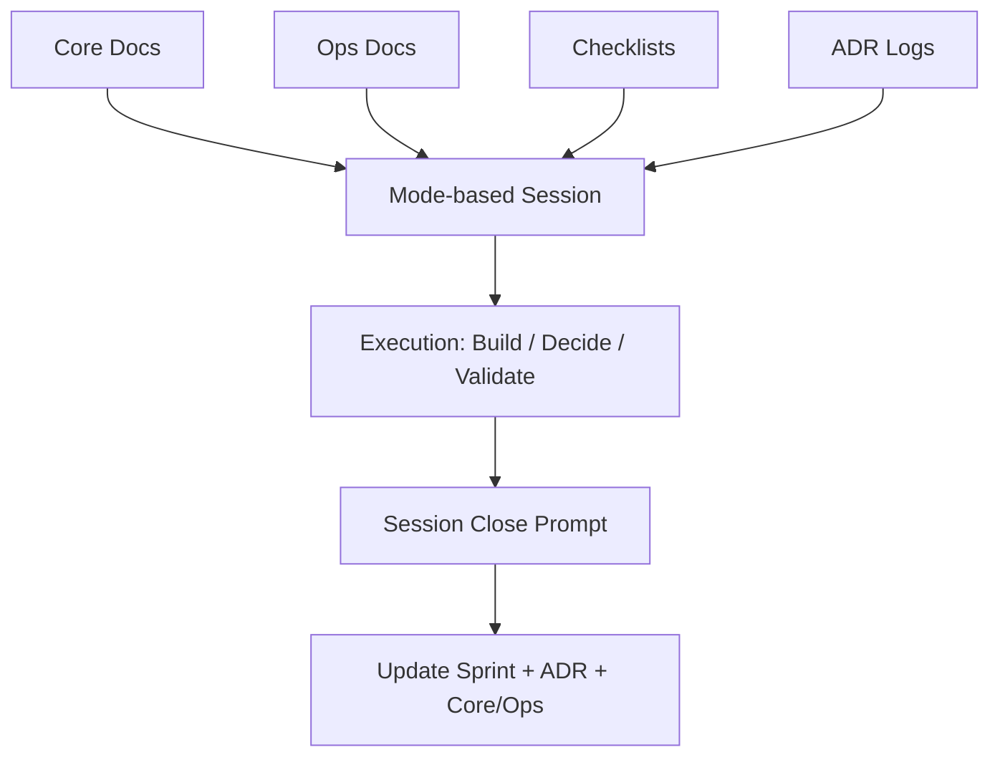

<p align="center">
  
</p>

<h1 align="center">Make Me Unicorn</h1>
<p align="center">
  <strong>The open-source SaaS blueprint — 400+ actionable checks, zero execution drift.</strong>
</p>

<p align="center">
  <a href="./LICENSE"></a>
  <a href="./ROADMAP.md"></a>
  <a href="./CONTRIBUTING.md"></a>
  <a href="./SPEC.md"></a>
  <a href="./.github/workflows/mmu-guardrails.yml"></a>
</p>

<!-- Demo GIF placeholder — record with asciinema or vhs and replace -->
<p align="center">
  
</p>

---

## Why Make Me Unicorn?

Most solo founders don't fail because of missing code — they fail because of **execution drift**.
Context resets between tools, decisions vanish, and critical blind spots slip through.

| | Boilerplate (open-saas) | Awesome List | ShipFast | **Make Me Unicorn** |
|---|---|---|---|---|
| Price | Free | Free | $199+ | **Free** |
| Code template | Yes | No | Yes | No |
| Business methodology | No | No | No | **Yes** |
| Full-stack checklist | No | No | Partial | **Yes (400+)** |
| Execution tracking | No | No | No | **Yes (CLI)** |
| Tool recommendations | No | Links only | No | **Yes (Curated)** |

Make Me Unicorn is not a boilerplate. It's the **operating system** that tells you *what to build, in what order, and what not to forget* — regardless of your tech stack.

---

## Get Started in 5 Minutes

```bash
# 1. Clone
git clone https://github.com/minjikim89/make-me-unicorn.git
cd make-me-unicorn

# 2. Install CLI
pip install -e .

# 3. Start a session
mmu start --mode product

# 4. Run health check
mmu doctor

# 5. Validate a phase gate
mmu gate --stage M2

# 6. Close session
mmu close
```

No-install fallback:

```bash
PYTHONPATH=src python3 -m mmu_cli doctor
```

---

## Full-Stack SaaS Blueprint

**15 deep-dive checklists** covering every layer of a production SaaS — from frontend to accessibility.

| # | Blueprint | Items | What It Covers |
|---|---|---|---|
| 01 | [Frontend](./docs/blueprints/01-frontend.md) | 35 | Framework, routing, state, forms, performance |
| 02 | [Backend](./docs/blueprints/02-backend.md) | 40 | API, database, caching, queues, logging |
| 03 | [Auth](./docs/blueprints/03-auth.md) | 30 | Login, sessions, MFA, RBAC, account management |
| 04 | [Billing](./docs/blueprints/04-billing.md) | 25 | Checkout, subscriptions, refunds, portal |
| 05 | [DevOps](./docs/blueprints/05-devops.md) | 30 | Hosting, containers, DNS, secrets, rollback |
| 06 | [Security](./docs/blueprints/06-security.md) | 30 | OWASP top 10, headers, input validation |
| 07 | [Monitoring](./docs/blueprints/07-monitoring.md) | 25 | Error tracking, APM, alerting, incidents |
| 08 | [SEO & Marketing](./docs/blueprints/08-seo-marketing.md) | 25 | Technical SEO, OG tags, content strategy |
| 09 | [Legal & Compliance](./docs/blueprints/09-legal-compliance.md) | 25 | GDPR, CCPA, privacy policy, cookie consent |
| 10 | [Performance](./docs/blueprints/10-performance.md) | 25 | Core Web Vitals, caching, load testing |
| 11 | [Testing](./docs/blueprints/11-testing.md) | 25 | Unit, integration, E2E, component testing |
| 12 | [CI/CD](./docs/blueprints/12-cicd.md) | 20 | Pipeline, branch strategy, releases |
| 13 | [Email & Notifications](./docs/blueprints/13-email-notifications.md) | 20 | Transactional, marketing, in-app, push |
| 14 | [Analytics](./docs/blueprints/14-analytics.md) | 20 | Product, business, web analytics, A/B tests |
| 15 | [Accessibility](./docs/blueprints/15-accessibility.md) | 25 | WCAG 2.2 AA, ARIA, keyboard, screen readers |

Each blueprint includes a **Recommended Stack** table with curated tool picks.

> See the full index and quick stack reference at [`docs/blueprints/README.md`](./docs/blueprints/README.md).

---

## SaaS From Scratch Gates

Six non-negotiable phase gates from idea to scale.

| Gate | Objective | Exit Criteria |
|---|---|---|
| `M0 Problem Fit` | Validate customer and problem | ICP, problem statement, success metric defined |
| `M1 Build Fit` | Deliver core product value | End-to-end core flow works with error states |
| `M2 Revenue Fit` | Add pricing and payment | Paid plan, success/failure/refund paths verified |
| `M3 Trust Fit` | Establish trust baseline | Privacy/terms/support path/logging in place |
| `M4 Growth Fit` | Enable discoverability | Metadata, OG image, sitemap, analytics live |
| `M5 Scale Fit` | Prepare resilient operation | Backup/recovery/incident playbook enforced |

Full checklist: [`docs/checklists/from_scratch.md`](./docs/checklists/from_scratch.md)

---

<details>
<summary><strong>Mode System</strong> — one mode per session keeps decisions coherent</summary>

| Mode | Purpose | Primary Inputs |
|---|---|---|
| `problem` | ICP, pain, hypothesis | `docs/core/strategy.md`, `docs/research/*` |
| `product` | Scope and prioritization | `docs/core/product.md`, `docs/ops/roadmap.md` |
| `design` | UX/UI and content | `docs/core/ux.md`, `docs/core/product.md` |
| `frontend` | Client implementation | `docs/core/architecture.md`, `current_sprint.md` |
| `backend` | API/data/jobs | `docs/core/architecture.md`, `current_sprint.md`, `docs/adr/*` |
| `auth` | Identity and access | `docs/checklists/auth_security.md`, `docs/core/architecture.md` |
| `billing` | Plans/payment/refunds | `docs/core/pricing.md`, `docs/checklists/billing_tax.md`, `docs/ops/compliance.md` |
| `growth` | SEO/distribution | `docs/checklists/seo_distribution.md`, `docs/ops/metrics.md` |
| `compliance` | Policy/data/legal baseline | `docs/ops/compliance.md`, `docs/core/pricing.md` |
| `reliability` | Monitoring/backup/incident | `docs/ops/reliability.md`, `docs/checklists/release_readiness.md` |
| `analytics` | Event model/experiments | `docs/ops/metrics.md`, `docs/core/product.md` |
| `launch` | Release readiness | `docs/checklists/release_readiness.md`, `docs/ops/roadmap.md` |

Full rules: [`docs/ops/mode_playbook.md`](./docs/ops/mode_playbook.md)

</details>

---

## Architecture



---

## What You Get

| Layer | Contents |
|---|---|
| Operating hub | `Unicorn.md` |
| Strategy & product | `docs/core/*` |
| Operations | `docs/ops/*` |
| Gate checklists | `docs/checklists/*` (5 files, 80+ items) |
| **Deep-dive blueprints** | **`docs/blueprints/*` (15 files, 400+ items)** |
| Decision memory | `docs/adr/*` |
| Session prompts | `prompts/start.md`, `prompts/close.md`, `prompts/adr.md` |
| CLI | `mmu start`, `mmu doctor`, `mmu gate`, `mmu close` |
| CI guardrails | `.github/workflows/mmu-guardrails.yml` |
| Filled example | `examples/filled/tasknote/` |

---

## Why This Exists

Without a system, solo founders hit the same blind spots:

- Missing account recovery while implementing login
- Running payment without refund/cancellation policy
- No webhook signature verification or idempotency
- No `dev/staging/prod` separation before release
- Missing OG thumbnail and social link preview validation
- Policy pages exist but no data deletion workflow

Make Me Unicorn prevents these with structured docs, phase gates, and 400+ implementation checks.

---

<details>
<summary><strong>CI Guardrails</strong></summary>

`doctor` runs on every PR/push.
`gate` runs only for stages listed in `docs/ops/gate_targets.txt`.
No stages are enforced by default. Add lines such as `M0` and `M1` to enable strict gate blocking.
Branch protection baseline: [`docs/ops/repo_protection.md`](./docs/ops/repo_protection.md).

</details>

<details>
<summary><strong>Brand Setup</strong></summary>

1. Replace the default hero image at `assets/brand/unicorn-hero.svg`.
2. Place your social preview image at `assets/brand/og-cover.png`.
3. In GitHub repo settings, set Social preview to `assets/brand/og-cover.png`.
4. Verify link previews on Slack/X/Kakao/Messenger.

</details>

<details>
<summary><strong>Filled Example</strong></summary>

See a concrete, filled-out SaaS operation: [`examples/filled/tasknote/README.md`](./examples/filled/tasknote/README.md)

</details>

<details>
<summary><strong>Evolution Path</strong></summary>

For staged maturation from MVP to later phases, see [`docs/ops/evolution_path.md`](./docs/ops/evolution_path.md).

</details>

---

## Star History

<p align="center">
  <a href="https://star-history.com/#minjikim89/make-me-unicorn&Date">
    
  </a>
</p>

---

## Contributing

See [`CONTRIBUTING.md`](./CONTRIBUTING.md). PRs and issues are welcome.

## Roadmap

See [`ROADMAP.md`](./ROADMAP.md).

## Security

See [`SECURITY.md`](./SECURITY.md).

## Changelog

See [`CHANGELOG.md`](./CHANGELOG.md).

## License

MIT. See [`LICENSE`](./LICENSE).
